# AC-VMIS Entity-Relationship Diagram (ERD)

This document presents the AC-VMIS Entity-Relationship Diagram using Crow's Foot notation in Mermaid syntax. The ERD is intended for thesis documentation and focuses on the core domain entities of the system rather than framework support tables such as `cache`, `jobs`, `migrations`, `sessions`, and `password_reset_tokens`.

The current academic module includes an OCR-assisted eligibility workflow. Uploaded grade documents are stored in `academic_documents`, processed through `academic_document_ocr_runs`, summarized in parsed output tables, and finalized in `academic_eligibility_evaluations` with support for administrator review and override.

The current attendance workflow is schedule-based and coach-led. Legacy student QR attendance tables and routes are intentionally excluded from the final ERD because attendance is now recorded through the coach schedule modal backed by `team_schedules` and `schedule_attendances`.

## Diagram

```mermaid
erDiagram
    USERS {
        bigint id PK
        varchar first_name
        varchar middle_name
        varchar last_name
        varchar email UK
        timestamp email_verified_at
        varchar password
        boolean must_change_password
        varchar role
        enum account_state
        varchar avatar
        timestamp created_at
        timestamp updated_at
    }

    STUDENTS {
        bigint id PK
        bigint user_id FK, UK
        varchar student_id_number UK
        date date_of_birth
        enum gender
        text home_address
        varchar course_or_strand
        varchar current_grade_level
        enum approval_status
        enum student_status
        varchar phone_number
        decimal height
        decimal weight
        varchar emergency_contact_name
        varchar emergency_contact_relationship
        varchar emergency_contact_phone
        timestamp created_at
        timestamp updated_at
    }

    COACHES {
        bigint id PK
        bigint user_id FK, UK
        varchar phone_number
        date date_of_birth
        enum gender
        varchar home_address
        enum coach_status
        timestamp created_at
        timestamp updated_at
    }

    USER_SETTINGS {
        bigint id PK
        bigint user_id FK, UK
        boolean notification_email_enabled
        boolean notify_approvals
        boolean notify_schedule_changes
        boolean notify_attendance_changes
        boolean notify_wellness_alerts
        boolean notify_academic_alerts
        boolean notify_attendance_exceptions
        boolean notify_wellness_injury_threshold
        tinyint wellness_injury_threshold_level
        timestamp created_at
        timestamp updated_at
    }

    SPORTS {
        bigint id PK
        varchar name UK
        timestamp created_at
        timestamp updated_at
    }

    TEAMS {
        bigint id PK
        varchar team_name
        varchar team_avatar
        bigint sport_id FK
        year year
        text description
        timestamp archived_at
        bigint archived_by FK
        timestamp created_at
        timestamp updated_at
    }

    TEAM_STAFF_ASSIGNMENTS {
        bigint id PK
        bigint team_id FK
        bigint coach_id FK
        enum role
        timestamp starts_at
        timestamp ends_at
        bigint created_by FK
        timestamp created_at
        timestamp updated_at
    }

    TEAM_PLAYERS {
        bigint id PK
        bigint team_id FK
        bigint student_id FK
        varchar jersey_number
        varchar athlete_position
        enum player_status
        timestamp created_at
        timestamp updated_at
    }

    TEAM_SCHEDULES {
        bigint id PK
        bigint team_id FK
        varchar title
        enum type
        varchar venue
        datetime start_time
        datetime end_time
        text notes
        timestamp created_at
        timestamp updated_at
    }

    SCHEDULE_ATTENDANCES {
        bigint id PK
        bigint schedule_id FK
        bigint student_id FK
        enum status
        enum verification_method
        bigint recorded_by FK
        timestamp recorded_at
        timestamp verified_at
        text notes
        text override_reason
        timestamp created_at
        timestamp updated_at
    }

    WELLNESS_LOGS {
        bigint id PK
        bigint student_id FK
        bigint schedule_id FK
        bigint logged_by FK
        date log_date
        boolean injury_observed
        text injury_notes
        tinyint fatigue_level
        enum performance_condition
        text remarks
        timestamp created_at
        timestamp updated_at
    }

    ACADEMIC_PERIODS {
        bigint id PK
        varchar school_year
        enum term
        date starts_on
        date ends_on
        timestamp created_at
        timestamp updated_at
    }

    ACADEMIC_PERIOD_MESSAGES {
        bigint id PK
        bigint academic_period_id FK
        text message
        timestamp published_at
        bigint created_by FK
        timestamp created_at
        timestamp updated_at
    }

    ACADEMIC_DOCUMENT_TYPES {
        bigint id PK
        enum context
        varchar code
        varchar label
    }

    ACADEMIC_DOCUMENTS {
        bigint id PK
        bigint student_id FK
        bigint document_type_id FK
        bigint academic_period_id FK
        varchar file_path
        bigint uploaded_by FK
        timestamp uploaded_at
        text notes
        enum review_status
        bigint reviewed_by FK
        timestamp reviewed_at
        timestamp created_at
        timestamp updated_at
    }

    ACADEMIC_DOCUMENT_OCR_RUNS {
        bigint id PK
        bigint academic_document_id FK
        varchar ocr_engine
        varchar ocr_engine_version
        enum run_status
        longtext raw_text
        decimal mean_confidence
        enum validation_status
        text validation_summary
        json validation_flags
        timestamp validation_checked_at
        timestamp processed_at
        text error_message
        timestamp created_at
        timestamp updated_at
    }

    ACADEMIC_DOCUMENT_PARSED_SUMMARIES {
        bigint id PK
        bigint academic_document_ocr_run_id FK
        decimal gwa
        decimal total_units
        enum parser_status
        decimal parser_confidence
        timestamp created_at
        timestamp updated_at
    }

    ACADEMIC_ELIGIBILITY_EVALUATIONS {
        bigint id PK
        bigint student_id FK
        bigint academic_period_id FK
        bigint document_id FK
        bigint academic_document_ocr_run_id FK
        decimal gpa
        enum evaluation_source
        enum final_status
        boolean review_required
        bigint evaluated_by FK
        timestamp evaluated_at
        text remarks
        timestamp created_at
        timestamp updated_at
    }

    ACADEMIC_HOLDS {
        bigint id PK
        bigint student_id FK
        bigint source_period_id FK
        enum reason
        enum status
        timestamp started_at
        timestamp resolved_at
        timestamp created_at
        timestamp updated_at
    }

    STUDENT_APPROVAL_HISTORIES {
        bigint id PK
        bigint student_id FK
        bigint admin_id FK
        enum decision
        varchar remarks
        timestamp created_at
        timestamp updated_at
    }

    ANNOUNCEMENT_EVENTS {
        bigint id PK
        varchar title
        text message
        enum type
        timestamp published_at
        bigint created_by FK
        timestamp created_at
        timestamp updated_at
    }

    ANNOUNCEMENT_RECIPIENTS {
        bigint id PK
        bigint event_id FK
        bigint user_id FK
        timestamp read_at
        timestamp created_at
        timestamp updated_at
    }

    ADMIN_INVITES {
        bigint id PK
        varchar email
        varchar token_hash UK
        bigint created_by FK
        timestamp expires_at
        timestamp used_at
        timestamp created_at
        timestamp updated_at
    }

    ACCOUNT_ACTION_LOGS {
        bigint id PK
        bigint user_id FK
        bigint admin_id FK
        varchar action
        varchar remarks
        timestamp created_at
        timestamp updated_at
    }

    USERS ||--o| STUDENTS : "owns profile"
    USERS ||--o| COACHES : "owns profile"
    USERS ||--o{ USER_SETTINGS : "configures"
    USERS ||--o{ ACCOUNT_ACTION_LOGS : "is target of"
    USERS ||--o{ ACCOUNT_ACTION_LOGS : "performs"
    USERS ||--o{ ADMIN_INVITES : "creates"
    USERS ||--o{ ANNOUNCEMENT_EVENTS : "publishes"
    USERS ||--o{ ANNOUNCEMENT_RECIPIENTS : "receives"
    USERS ||--o{ ACADEMIC_DOCUMENTS : "uploads"
    USERS ||--o{ ACADEMIC_DOCUMENTS : "reviews"
    USERS ||--o{ ACADEMIC_ELIGIBILITY_EVALUATIONS : "evaluates"
    USERS ||--o{ ACADEMIC_PERIOD_MESSAGES : "creates"
    USERS ||--o{ ATHLETE_HEALTH_CLEARANCES : "reviews"
    USERS ||--o{ SCHEDULE_ATTENDANCES : "records"
    USERS ||--o{ STUDENT_APPROVAL_HISTORIES : "approves or rejects"
    USERS ||--o{ TEAM_STAFF_ASSIGNMENTS : "creates"
    USERS ||--o{ TEAMS : "archives"
    USERS ||--o{ WELLNESS_LOGS : "records"

    SPORTS ||--o{ TEAMS : "categorizes"

    TEAMS ||--o{ TEAM_PLAYERS : "includes"
    STUDENTS ||--o{ TEAM_PLAYERS : "is assigned to"

    TEAMS ||--o{ TEAM_STAFF_ASSIGNMENTS : "has"
    COACHES ||--o{ TEAM_STAFF_ASSIGNMENTS : "serves in"

    TEAMS ||--o{ TEAM_SCHEDULES : "has"
    TEAM_SCHEDULES ||--o{ SCHEDULE_ATTENDANCES : "records"
    STUDENTS ||--o{ SCHEDULE_ATTENDANCES : "has"

    STUDENTS ||--o{ WELLNESS_LOGS : "has"
    TEAM_SCHEDULES ||--o{ WELLNESS_LOGS : "contextualizes"
    STUDENTS ||--o{ ATHLETE_HEALTH_CLEARANCES : "has"

    ACADEMIC_PERIODS ||--o{ ACADEMIC_PERIOD_MESSAGES : "announces"
    ACADEMIC_PERIODS ||--o{ ACADEMIC_DOCUMENTS : "receives"
    ACADEMIC_PERIODS ||--o{ ACADEMIC_ELIGIBILITY_EVALUATIONS : "evaluates"
    ACADEMIC_PERIODS ||--o{ ACADEMIC_HOLDS : "originates"

    ACADEMIC_DOCUMENT_TYPES ||--o{ ACADEMIC_DOCUMENTS : "classifies"
    STUDENTS ||--o{ ACADEMIC_DOCUMENTS : "submits"
    ACADEMIC_DOCUMENTS ||--o{ ACADEMIC_DOCUMENT_OCR_RUNS : "is processed by"

    ACADEMIC_DOCUMENT_OCR_RUNS ||--o| ACADEMIC_DOCUMENT_PARSED_SUMMARIES : "produces"
    STUDENTS ||--o{ ACADEMIC_ELIGIBILITY_EVALUATIONS : "undergoes"
    ACADEMIC_DOCUMENTS ||--o{ ACADEMIC_ELIGIBILITY_EVALUATIONS : "supports"
    ACADEMIC_DOCUMENT_OCR_RUNS ||--o{ ACADEMIC_ELIGIBILITY_EVALUATIONS : "feeds"

    STUDENTS ||--o{ ACADEMIC_HOLDS : "is subject to"
    STUDENTS ||--o{ STUDENT_APPROVAL_HISTORIES : "receives"

    ANNOUNCEMENT_EVENTS ||--o{ ANNOUNCEMENT_RECIPIENTS : "targets"
```

## Review Decisions

The final ERD intentionally keeps only the active domain schema. The following legacy tables are excluded because they represent replaced workflows or temporary normalization steps:

- `account_approvals`
- `announcements`
- `schedule_qr_tokens`
- `academic_evaluation_documents`
- `academic_document_parsed_subjects`
- `wellness_attachments`

The diagram also reflects the post-normalization announcement design, where reusable content lives in `announcement_events` and user-specific read state lives in `announcement_recipients`.

## Refactor Notes

The current schema is close to 3NF for the active workflows, but these follow-up refinements are still recommended:

- Add `UNIQUE(team_id, jersey_number)` on `team_players` if jersey numbers must be unique within a team roster.
- Keep `students.current_grade_level` only if it remains the canonical academic level field for both SHS and college students; otherwise split or standardize it further.
- Keep `academic_eligibility_evaluations.final_status` only as the official adjudicated result. If it is always derived from `gpa`, it should be treated as redundant.
- Rename the application model that maps to `announcement_recipients` from `Announcement` to a recipient-specific name to match the normalized schema more clearly.

## Workflow Gap

Notifications are supported by `announcement_events`, `announcement_recipients`, and `user_settings`, but support tickets are not yet represented in the current schema or codebase. A future support module would likely introduce:

- `support_tickets`
- `support_ticket_messages`
- `support_ticket_attachments`

## Normalization Note

The AC-VMIS database design is consistent with Third Normal Form (3NF) for the core domain model because:

1. Each entity has a single primary key that uniquely identifies each record.
2. Repeating groups and many-to-many associations are resolved through intersection entities such as `team_players`, `team_staff_assignments`, and `announcement_recipients`.
3. Non-key attributes are stored in the entity to which they are directly dependent, thereby reducing redundancy and update anomalies.
4. Lookup and classification data are separated into independent entities such as `sports` and `academic_document_types`.
5. Workflow history and audit data are normalized into dedicated entities such as `student_approval_histories`, `account_action_logs`, `academic_document_ocr_runs`, and `academic_period_messages`.

Important examples of already-completed normalization include:

- moving personal name fields from `students` and `coaches` into `users`
- replacing direct coach columns on `teams` with `team_staff_assignments`
- replacing duplicated per-user announcement content with `announcement_events` plus `announcement_recipients`
- removing legacy QR attendance structures in favor of the schedule-based coach attendance workflow

The academic eligibility module follows the same normalization approach by separating:

- source documents in `academic_documents`
- OCR execution history in `academic_document_ocr_runs`
- parsed summary outputs in `academic_document_parsed_summaries`
- evaluation outcomes in `academic_eligibility_evaluations`

For thesis presentation, the ERD represents the intended normalized design of AC-VMIS. In particular, `users` to `user_settings` and `academic_document_ocr_runs` to `academic_document_parsed_summaries` are modeled as optional one-to-one business relationships. If the physical database is to fully enforce that intent, the foreign keys `user_settings.user_id` and `academic_document_parsed_summaries.academic_document_ocr_run_id` should remain unique.

## Legend

- `PK` denotes a primary key.
- `FK` denotes a foreign key.
- `UK` denotes a unique attribute.
- `||` denotes exactly one.
- `o|` denotes zero or one.
- `|{` denotes one or many.
- `o{` denotes zero or many.

## Presentation Note

For thesis presentation, the full ERD above may be complemented by module-based extracts for better readability, such as:

- User and account management
- Sports and attendance management
- Wellness and medical monitoring
- Academic eligibility and OCR-assisted evaluation
