# AC-VMIS Entity-Relationship Diagram (Operational ERD)

This ERD presents the active operational design of AC-VMIS. It reflects the entities currently used by the implemented application workflows and intentionally excludes deprecated or unused concepts from the final thesis narrative, even if some legacy tables still exist in the development database.

Excluded from this operational ERD are legacy or inactive concepts such as QR-based attendance, public coach registration, health-clearance workflow tables, academic hold enforcement, and academic period message publishing.

## Diagram

```mermaid
erDiagram
    USERS {
        bigint id PK
        varchar email UK
        varchar role
        enum account_state
        varchar first_name
        varchar middle_name
        varchar last_name
        varchar avatar
        boolean must_change_password
        timestamp email_verified_at
    }

    STUDENTS {
        bigint id PK
        bigint user_id FK
        varchar student_id_number UK
        varchar course_or_strand
        varchar current_grade_level
        enum approval_status
        enum student_status
        varchar phone_number
    }

    COACHES {
        bigint id PK
        bigint user_id FK
        enum coach_status
        varchar phone_number
    }

    USER_SETTINGS {
        bigint id PK
        bigint user_id FK
        boolean notification_email_enabled
        boolean notify_approvals
        boolean notify_schedule_changes
        boolean notify_attendance_changes
        boolean notify_wellness_alerts
        boolean notify_academic_alerts
        boolean notify_attendance_exceptions
        boolean notify_wellness_injury_threshold
        tinyint wellness_injury_threshold_level
    }

    ADMIN_INVITES {
        bigint id PK
        varchar email
        varchar token_hash
        bigint created_by FK
        timestamp expires_at
        timestamp used_at
    }

    SPORTS {
        bigint id PK
        varchar name UK
    }

    TEAMS {
        bigint id PK
        bigint sport_id FK
        varchar team_name
        varchar team_avatar
        year year
        text description
        timestamp archived_at
        bigint archived_by FK
    }

    TEAM_STAFF_ASSIGNMENTS {
        bigint id PK
        bigint team_id FK
        bigint coach_id FK
        enum role
        timestamp starts_at
        timestamp ends_at
        bigint created_by FK
    }

    TEAM_PLAYERS {
        bigint id PK
        bigint team_id FK
        bigint student_id FK
        varchar jersey_number
        varchar athlete_position
        enum player_status
    }

    TEAM_SCHEDULES {
        bigint id PK
        bigint team_id FK
        varchar title
        enum type
        varchar venue
        datetime start_time
        datetime end_time
        text notes
    }

    SCHEDULE_ATTENDANCES {
        bigint id PK
        bigint schedule_id FK
        bigint student_id FK
        enum status
        enum verification_method
        bigint recorded_by FK
        timestamp recorded_at
        timestamp verified_at
        text notes
        text override_reason
    }

    WELLNESS_LOGS {
        bigint id PK
        bigint student_id FK
        bigint schedule_id FK
        bigint logged_by FK
        date log_date
        boolean injury_observed
        text injury_notes
        tinyint fatigue_level
        enum performance_condition
        text remarks
    }

    ACADEMIC_PERIODS {
        bigint id PK
        varchar school_year
        enum term
        date starts_on
        date ends_on
        enum status
    }

    ACADEMIC_DOCUMENT_TYPES {
        bigint id PK
        enum context
        varchar code
        varchar label
    }

    ACADEMIC_DOCUMENTS {
        bigint id PK
        bigint student_id FK
        bigint document_type_id FK
        bigint academic_period_id FK
        varchar file_path
        bigint uploaded_by FK
        timestamp uploaded_at
        enum review_status
        bigint reviewed_by FK
        timestamp reviewed_at
        text notes
    }

    ACADEMIC_DOCUMENT_OCR_RUNS {
        bigint id PK
        bigint academic_document_id FK
        varchar ocr_engine
        varchar ocr_engine_version
        enum run_status
        decimal mean_confidence
        enum validation_status
        text validation_summary
        json validation_flags
        timestamp processed_at
    }

    ACADEMIC_DOCUMENT_PARSED_SUMMARIES {
        bigint id PK
        bigint academic_document_ocr_run_id FK
        decimal gwa
        decimal total_units
        enum parser_status
        decimal parser_confidence
    }

    ACADEMIC_ELIGIBILITY_EVALUATIONS {
        bigint id PK
        bigint student_id FK
        bigint academic_period_id FK
        bigint document_id FK
        bigint academic_document_ocr_run_id FK
        decimal gpa
        enum evaluation_source
        enum final_status
        boolean review_required
        bigint evaluated_by FK
        timestamp evaluated_at
        text remarks
    }

    ANNOUNCEMENT_EVENTS {
        bigint id PK
        varchar title
        text message
        enum type
        timestamp published_at
        bigint created_by FK
    }

    ANNOUNCEMENT_RECIPIENTS {
        bigint id PK
        bigint event_id FK
        bigint user_id FK
        timestamp read_at
    }

    STUDENT_APPROVAL_HISTORIES {
        bigint id PK
        bigint user_id FK
        bigint admin_id FK
        enum decision
        text remarks
        timestamp decided_at
    }

    ACCOUNT_ACTION_LOGS {
        bigint id PK
        bigint user_id FK
        bigint admin_id FK
        varchar action
        varchar remarks
    }

    USERS ||--o| STUDENTS : has
    USERS ||--o| COACHES : has
    USERS ||--o| USER_SETTINGS : configures
    USERS ||--o{ ADMIN_INVITES : creates
    USERS ||--o{ ACADEMIC_DOCUMENTS : uploads
    USERS ||--o{ ACADEMIC_DOCUMENTS : reviews
    USERS ||--o{ ACADEMIC_ELIGIBILITY_EVALUATIONS : finalizes
    USERS ||--o{ ANNOUNCEMENT_EVENTS : publishes
    USERS ||--o{ ANNOUNCEMENT_RECIPIENTS : receives
    USERS ||--o{ STUDENT_APPROVAL_HISTORIES : reviews
    USERS ||--o{ ACCOUNT_ACTION_LOGS : affects

    SPORTS ||--o{ TEAMS : classifies
    TEAMS ||--o{ TEAM_STAFF_ASSIGNMENTS : uses
    TEAMS ||--o{ TEAM_PLAYERS : contains
    TEAMS ||--o{ TEAM_SCHEDULES : schedules

    COACHES ||--o{ TEAM_STAFF_ASSIGNMENTS : assigned_to
    STUDENTS ||--o{ TEAM_PLAYERS : joins
    STUDENTS ||--o{ SCHEDULE_ATTENDANCES : recorded_for
    STUDENTS ||--o{ WELLNESS_LOGS : monitored_in
    STUDENTS ||--o{ ACADEMIC_DOCUMENTS : submits
    STUDENTS ||--o{ ACADEMIC_ELIGIBILITY_EVALUATIONS : evaluated_in

    TEAM_SCHEDULES ||--o{ SCHEDULE_ATTENDANCES : has
    TEAM_SCHEDULES ||--o{ WELLNESS_LOGS : contextualizes

    ACADEMIC_PERIODS ||--o{ ACADEMIC_DOCUMENTS : groups
    ACADEMIC_PERIODS ||--o{ ACADEMIC_ELIGIBILITY_EVALUATIONS : scopes
    ACADEMIC_DOCUMENT_TYPES ||--o{ ACADEMIC_DOCUMENTS : classifies
    ACADEMIC_DOCUMENTS ||--o{ ACADEMIC_DOCUMENT_OCR_RUNS : processed_by
    ACADEMIC_DOCUMENTS ||--o{ ACADEMIC_ELIGIBILITY_EVALUATIONS : supports
    ACADEMIC_DOCUMENT_OCR_RUNS ||--o| ACADEMIC_DOCUMENT_PARSED_SUMMARIES : summarized_as
    ACADEMIC_DOCUMENT_OCR_RUNS ||--o{ ACADEMIC_ELIGIBILITY_EVALUATIONS : informs

    ANNOUNCEMENT_EVENTS ||--o{ ANNOUNCEMENT_RECIPIENTS : delivered_as
```

## ERD Notes

- `users` is the central identity table. Student-athlete and coach details are separated into role-specific profile tables.
- Team staffing is normalized through `team_staff_assignments` instead of fixed coach columns in `teams`.
- Attendance is modeled only through `team_schedules` and `schedule_attendances`.
- Academic evaluation is modeled as a multi-step pipeline: document upload, OCR run, parsed summary, and final eligibility evaluation.
- Announcements are normalized into reusable events and recipient-level delivery records.
- Approval history and account action logs provide audit-oriented administrative traceability.
